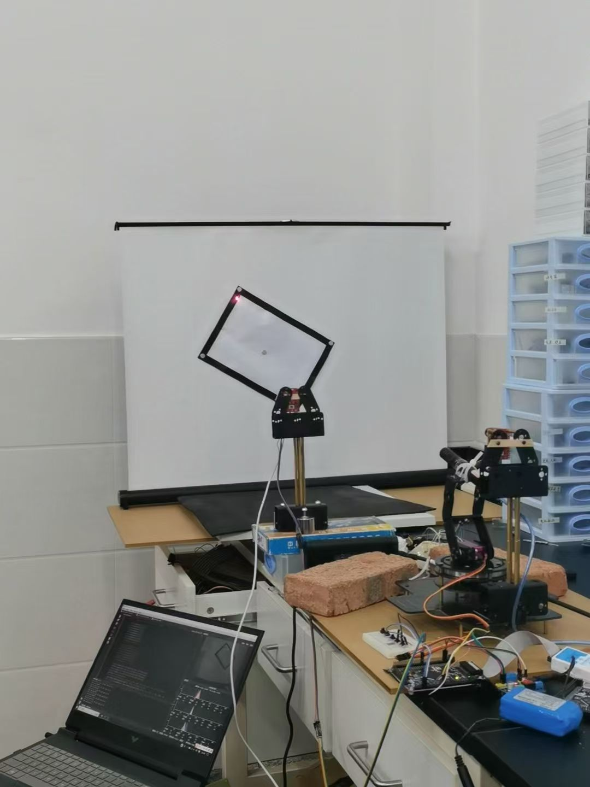

# 2023年全国大学生电子设计大赛：运动目标控制与自动追踪系统

本仓库整理的是一个基于 `STM32F407 + OpenMV + 双轴舵机云台` 的电赛项目代码，核心功能包括：

- 运动目标控制：控制红色激光点沿目标轨迹运动
- 自动追踪：控制绿色光斑自动追踪红色光斑
- 串口视觉通信：OpenMV 识别结果通过 UART 发送到 STM32
- 闭环控制：使用 PID 与逐步逼近思路完成位置修正

据项目论文摘要，本系统可实现：

- 运动目标控制系统在 `30s` 内完成巡线，平均误差约 `0.66 cm`
- 自动追踪系统在 `2s` 内完成追踪，两个光斑中心距离 `<= 3 cm`

## 效果演示
### 1.工作流程

### 2.成品图

## 仓库结构

```text
.
├─ firmware/
│  ├─ guosai_01_f4/          # 运动目标控制主工程
│  └─ guosai_01_f4_green/    # 绿色光斑自动追踪工程
├─ media/
│  └─ demo.mp4               # 演示视频
└─ README.md
```

## 工程说明

### 1. `firmware/guosai_01_f4`

这是当前仓库里更完整的主工程，偏向“运动目标控制”赛题实现。

主要代码位置：

- `Core/`：STM32 HAL 初始化代码与中断入口
- `User/Openmv.c`：OpenMV 串口协议解析
- `User/pid.c`：位置式 PID 控制
- `User/Servo.c`：轨迹控制、舵机动作与功能逻辑
- `MDK-ARM/guosai_01_f4.uvprojx`：Keil 工程文件

从代码逻辑看，按键会触发以下功能：

- `point()`：回到初始点
- `square()`：沿白色屏幕边界运动
- `black()`：沿固定黑色方框运动
- `four_two()`：闭环绕黑框运动
- `star()`：星形轨迹演示

### 2. `firmware/guosai_01_f4_green`

这是另一套派生工程，偏向“绿色光斑追踪红色光斑”的自动追踪功能。

与主工程相比，它的特点是：

- `User/Openmv.c` 接收的数据字段更少，明显针对双光斑坐标追踪
- `User/Servo.c` 中的 `tuozhan1_ZUO()`、`tuozhan2_ZUO()` 对应扩展追踪逻辑
- PID 参数与输出限幅也做了不同调整

## 硬件组成

根据项目论文与代码结构，系统主要包含以下模块：

- `STM32F407ZGT6` 主控
- `OpenMV` 视觉模块
- 双轴舵机云台
- 红色/绿色激光笔
- `OLED` 显示模块
- 语音提示模块
- 按键输入模块

## 构建与下载

推荐环境：

- `Keil MDK-ARM 5`
- `STM32CubeMX`（如需重新生成外设初始化）

打开方式：

1. 打开 `firmware/guosai_01_f4/MDK-ARM/guosai_01_f4.uvprojx`
2. 或打开 `firmware/guosai_01_f4_green/MDK-ARM/guosai_01_f4.uvprojx`
3. 检查芯片型号、下载器配置和串口连接
4. 编译后烧录到 `STM32F407`

## 串口通信说明

`User/Openmv.c` 显示 STM32 端采用了基于帧头和帧尾的串口协议解析：

- 帧头：`0x2C 0x12`
- 帧尾：`0x5B`

因此在完整复现时，OpenMV 端脚本需要按相同协议发送识别结果。

## 当前仓库的边界

目前仓库主要整理了 `STM32` 端工程，以下内容暂未完整纳入：

- OpenMV 端识别脚本
- 原理图 / PCB 文件
- 正式参赛论文 PDF
- 赛题书与项目书原件

